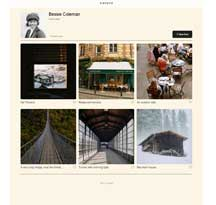
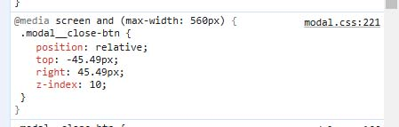
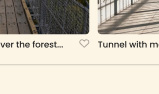
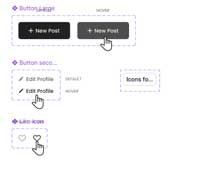

# Spots: A Social Media Web App

**Spots** is an interactive social media platform where users can share, like, and manage photos while personalizing their profiles. This project focuses on adaptive web design, offering a user-friendly interface across devices.

## Table of Contents
- [Overview](#overview)
- [Technologies and Techniques](#technologies-and-techniques)
- [Features](#features)
- [Getting Started](#getting-started)
- [Usage](#usage)
- [Design](#design)
- [Tech Notes](#tech-notes)
- [Links](#links)
- [Contact](contact)

## Overview

Spots is a social media application that lets users:
- Upload and remove photos
- Like and interact with others' posts
- Make minor profile adjustments

## Technologies and Techniques

- **Frontend**: HTML, CSS, Flexbox/Grid, Media Queries
- **Design**: Figma for UI/UX design

## Features

- Responsive design for mobile and desktop
- Interactive photo gallery with like functionality
- Editable user profile with personalization options

## Getting Started

Follow these steps to run the project locally:

1. **Clone the repository**:
    ```bash
    git clone https://github.com/tyrascroggins/spots.git
    ```
2. **Navigate to the project directory**:
    ```bash
    cd spots
    ```
3. **Open `files` in your prefered editing software**.

## Usage

Once the project is finished, you can:
- Add photos using the add posts feature.
- Like posts by clicking the heart icon.
- Edit your profile.

## Design

The UI/UX was designed using Figma. You can view the design details [here](https://www.figma.com/file/BBNm2bC3lj8QQMHlnqRsga/Sprint-3-Project-%E2%80%94-Spots?type=design&node-id=2%3A60&mode=design&t=afgNFybdorZO6cQo-1).



## Tech Notes

<div style="display: flex; max-width: 449px; border-width: 2px; border-color: #efefef; border-style: solid; padding: 20px; flex-direction: column">   per Figma I changed the media size needed to change to a bigger size due to the close button getting cut off. Also the Figma dementions of 45.49px appear to be the correct demintions for the top close button at media change.
  
</div>

<div style="display: flex; max-width: 500px; border-width: 2px; border-color: #efefef; border-style: solid; padding: 20px;">
  
  The designer requests using ellipsis with a maximum of three lines for the title and description, and one line for the image description. Also, note that the button is larger here. I do not recommend downloading the button image; it's best to style it using CSS.
</div>

<div style="display: flex; max-width: 500px; border-width: 2px; border-color: #efefef; border-style: solid; padding: 20px; flex-direction: column">
  
  I added padding to the heart/like button because it was being cut off on the right. You could alternatively set a max-width, but then you would need to include it in the @media queries as well. I found it simpler to add the slight padding instead. Also, note the one-line ellipsis here as well.
</div>

<div style="display: flex; max-width: 500px; border-width: 2px; border-color: #efefef; border-style: solid; padding: 20px;">
  
  Here we have the rollover transitions. Note that each one has a different starting transition. The pencil icon, I had originally set the width and height, but it was not displaying correctly, so I found that using the font-size width worked well.
</div>

## Links

**Live Link**  
[Launch Spots Website here](https://tyrascroggins.github.io/se_project_spots/)  

**Video**  
[A descriptive video explanation](https://drive.google.com/file/d/1BQ1rapRBq3zye4U2Vezi4THjTssNoIgW/view?usp=drive_link)  

## Contact

Software Engineer
Tyra Scroggins: tyrascroggins@gmail.com